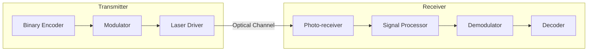

# Optical Wireless Communication System

This project implements a Semiconductor Laser-based Data Transmission System using Optical Wireless Communication (OWC) principles. It is designed for secure, line-of-sight data transfer between microcontroller nodes.

[](LICENSE)
[](https://www.arduino.cc/)
[](TECHNICAL_REFERENCE.md)

---

## Core System Architecture

The system provides the following technical capabilities:

- **Modulation Schemes**: Implementation of standard On-Off Keying (OOK) and self-clocking Manchester Encoding.
- **Error Detection**: Integrated CRC-8 checksum verification for frame-level data integrity.
- **Ambient Light Compensation**: Adaptive thresholding mechanism to normalize reception in variable lighting environments.
- **Synchronized Framing**: Byte-oriented framing protocol (0xAA/0x55) for reliable packet synchronization.
- **Control Interface**: Real-time parameter configuration via Serial interface.

---

## Technical Architecture



For detailed signal processing and modulation theory, refer to the [Technical Reference](TECHNICAL_REFERENCE.md).

---

## Hardware Implementation

### Pin Mapping Specification

| Component | Pin (Node A - RX) | Pin (Node B - TX) | Functional Description |
|-----------|------------------|-------------------|------------------------|
| Laser Diode | 2, 3 | 10, 9 | Optical Output |
| Photo-sensor | 7, 8 | 3, 2 | Optical Input |
| Indicator LED | 13, 24 | 13, 30 | Status Telemetry |
| Power Rail | 5V | 5V | VCC |

### Implementation Notes
- **Power Stability**: Use a dedicated 5V supply for consistent laser output intensity.
- **Receiver Circuit**: For photoresistor implementations, a voltage divider is required to interface with the ADC for adaptive thresholding.

---

## Software Interface

The `LaserCommunication` library provides a unified API for optical data handling.

### Example: Transmitter Node

```cpp
#include "LaserCommunication.h"

LaserCommunication link;

void setup() {
    Serial.begin(9600);
}

void loop() {
    String payload = "OWC_DATA_01";
    String frame = link.TextMapData(payload, 1);
    
    // Transmission using Manchester modulation for clock recovery
    link.transmit(frame, LASER_PIN, 250, LED_PIN, ModulationType::MANCHESTER);
    
    delay(1000);
}
```

---

## Troubleshooting and Optimization

- **Signal Saturation**: High ambient light may saturate the receiver. Use optical baffling or infrared filters to improve signal-to-noise ratio.
- **Clock Drift**: At high bitrates, standard OOK may lose synchronization. Manchester encoding is recommended for robust timing recovery.
- **Data Integrity**: If the receiver logs CRC failures, increase the `bitDuration` to account for photodiode rise/fall times.

---

## Development Roadmap
- [x] Manchester Encoding Implementation (v1.1)
- [x] CRC-8 Checksum Integration (v1.2)
- [ ] Forward Error Correction (Hamming 7,4)
- [ ] Bidirectional Full-Duplex Link

---

## License
Distributed under the MIT License. See `LICENSE` for details.
