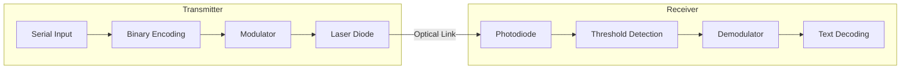

# **Laser Communication System**

> **An advanced engineering project demonstrating secure wireless data transmission using Laser-based Optical Wireless Communication (OWC).**

 
 


---

## **🚀 Core Capabilities**

- 🛠 **Dual modulation schemes**: Support for standard On-Off Keying (OOK) and robust, self-clocking Manchester Encoding.
- 🧪 **Advanced Error Detection**: Integrated **CRC-8 Checksum** for verifiable data integrity.
- 🌓 **Ambient Light Resistance**: Self-calibrating **Adaptive Thresholding** for robust reception in varying light conditions.
- 📡 **Synchronized Framing**: Robust data integrity using 0xAA/0x55 start/end flags.
- ⚡ **Precision Timing**: Optimized bit-duration logic for reliable line-of-sight transmission.
- 📊 **Serial Control interface**: Real-time modulation switching (OOK vs. Manchester) via serial commands.

---

## **📂 Technical Architecture**



For a deep dive into the signal processing logic, see the [Technical Reference](TECHNICAL_REFERENCE.md).

---

## **� Hardware Implementation**

### **Pin Mapping**

| Component | Arduino Pin (Point A) | Arduino Pin (Point B) | Purpose |
|-----------|-----------------------|-----------------------|---------|
| Laser Diode | 2, 3 | 10, 9 | Data Transmission |
| Photoresistor | 7, 8 | 3, 2 | Signal Reception |
| Status LED | 13, 24 | 13, 30 | TX/RX Indicators |
| Ground | GND | GND | Common Reference |

### **Electronic Schematic**
> [!TIP]
> Ensure the laser is powered by a stable 5V rail. For the receiver, use a voltage divider circuit if using a raw photoresistor to scale the analog/digital signal correctly.

---

## **💻 Software Usage**

The `LaserCommunication` library is designed for ease of use. Below is a professional usage example:

```cpp
#include "LaserCommunication.h"

LaserCommunication laser;

void setup() {
    Serial.begin(9600);
    pinMode(LASER_PIN, OUTPUT);
}

void loop() {
    String payload = "Hello World";
    
    // 1. Encode text to framed binary
    String frame = laser.TextMapData(payload, 1);
    
    // 2. Transmit using Manchester Encoding
    laser.transmit(frame, LASER_PIN, 250, LED_PIN, ModulationType::MANCHESTER);
    
    delay(1000);
}
```

---

## **⚠️ Troubleshooting**

- **No Signal Detected**: Ensure direct line-of-sight. Ambient light can saturate photoresistors; try using a dark tube or lens to focus the laser on the sensor.
- **Corrupted Data**: Check the `bitDuration`. If the receiver is too slow (using `delay()` in other parts of the code), reduce the baud rate by increasing `bitDuration`.
- **Manchester vs OOK**: If you experience high clock drift, switch to **Manchester** mode (`MODE:MAN`) as it provides self-clocking synchronization.

---

## **📈 Performance & Roadmap**
- [x] Manchester Encoding (v1.1)
- [ ] Adaptive Thresholding for Ambient Light
- [ ] Error Correction Codes (Hamming/CRC)
- [ ] Bi-directional Full Duplex Support

---

## **📜 License**
Distributed under the MIT License. See `LICENSE` for more information.

---
*Developed for research and educational purposes in Optical Wireless Communications.*
