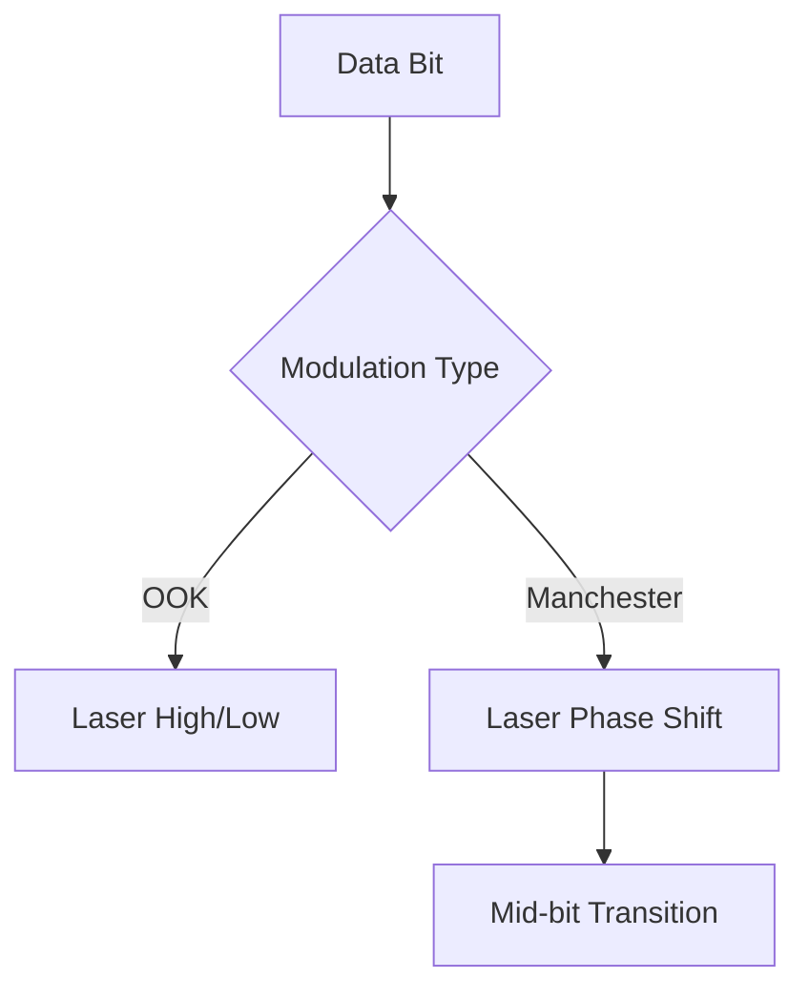

# Technical Reference: Modulation & Signal Processing

This document details the engineering principles and modulation techniques implemented in the Laser Communication System.

## 1. Modulation Schemes

### On-Off Keying (OOK)
OOK is the simplest form of Amplitude Shift Keying (ASK). It represents digital data as the presence or absence of a carrier wave (in this case, the laser beam).

- **Logic 1**: Laser ON
- **Logic 2**: Laser OFF

> [!NOTE]
> OOK is efficient but susceptible to ambient light noise and lacks self-clocking capabilities.

### Manchester Encoding
Manchester encoding is a line code in which the encoding of each data bit has at least one transition and occupies the same time. It is self-clocking, meaning a clock signal can be recovered from the encoded data.

- **Logic 1**: High-to-Low transition (at mid-bit)
- **Logic 0**: Low-to-High transition (at mid-bit)

#### Advantages:
- **DC Balance**: Ensures the average power is constant, which is better for many receivers.
- **Synchronization**: The midpoint transition allows the receiver to stay synchronized with the transmitter's clock.

## 2. Framing and Data Integrity

The system uses a frame-based approach to ensure data integrity:

| Field | Size | Description |
|-------|------|-------------|
| Start Flag | 8 bits | `10101010` (0xAA) |
| Payload | Variable | ASCII encoded data |
| CRC-8 | 8 bits | Error detection checksum |
| End Flag | 8 bits | `01010101` (0x55) |

## 3. Error Detection: CRC-8

To ensure data integrity, the system implements a **Cycle Redundancy Check (CRC-8)**. The transmitter calculates a checksum based on the payload and appends it to the frame. The receiver re-calculates the CRC and compares it; if they don't match, the packet is flagged as corrupted.

- **Polynomial**: `x^8 + x^2 + x + 1` (0x07)
- **Benefit**: Detects up to 100% of single-bit errors and most burst errors.

## 4. Signal Robustness: Adaptive Thresholding

In real-world Optical Wireless Communication (OWC), ambient light is a major noise source. The system features an **Adaptive Thresholding** mechanism:

1. **Calibration Phase**: The system samples ambient light levels for 500ms.
2. **Dynamic Offset**: It sets the `HIGH` threshold logic level relative to the measured ambient floor.
3. **Benefit**: Allows the system to function in varying lighting conditions without manual tuning.

## 5. Timing Constraints

The variable `bitDuration` determines the baud rate.
- **Default**: 250ms (4 bps)
- **Optimization**: For higher speeds, the `bitDuration` can be reduced, but requires more precise timing using `micros()` and higher-quality photodiodes.
