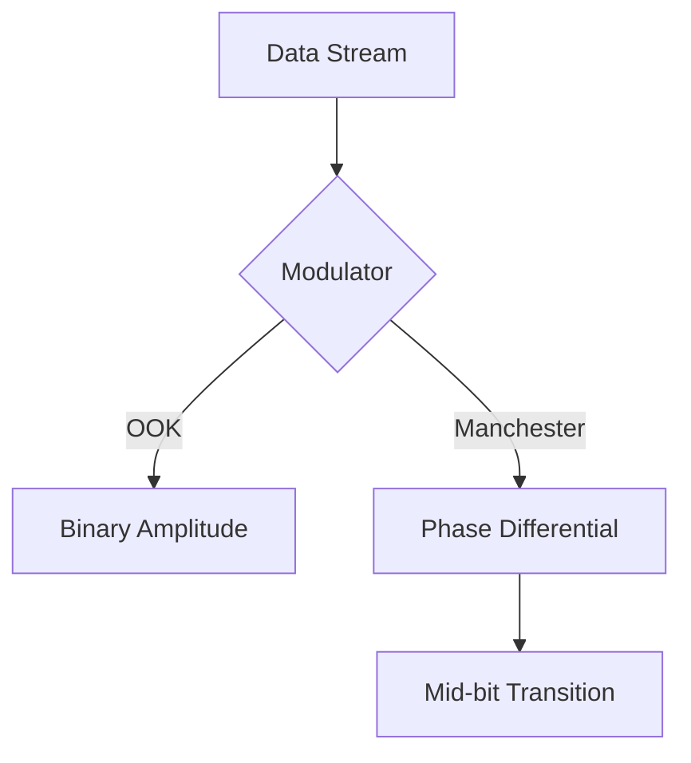

# Technical Reference: Modulation and Signal Processing

This document provides the theoretical basis and implementation details for the modulation techniques used in this system.

## 1. Modulation Schemes

### On-Off Keying (OOK)
OOK is an implementation of Amplitude Shift Keying (ASK) where data is represented by the presence or absence of a carrier wave (laser output).

- **Logic 1**: High state (Laser Active)
- **Logic 0**: Low state (Laser Inactive)

Note: While efficient, OOK is susceptible to ambient light interference and requires external clock synchronization for long data streams.

### Manchester Encoding
Manchester encoding is a differential line code where each bit transition occurs at the mid-point of the bit period. This ensures the signal is self-clocking and DC-balanced.

- **Logic 1**: High-to-Low transition at bit center.
- **Logic 0**: Low-to-High transition at bit center.

#### System Advantages
- **Timing Recovery**: The guaranteed transition at the center of each bit allows the receiver to synchronize its internal clock to the incoming data stream.
- **Constant Average Power**: DC balance reduces the impact of baseline wander in optical receivers.

## 2. Framing and Data Integrity

The communication protocol utilizes a byte-oriented framing structure:

| Field | Size | Functional Description |
|-------|------|------------------------|
| Preamble | 8 bits | `10101010` (0xAA) |
| Payload | Variable | Data Payload (ASCII) |
| Checksum | 8 bits | CRC-8 Error Detection |
| Postamble | 8 bits | `01010101` (0x55) |

## 3. Error Detection: CRC-8

To ensure data integrity, the system implements a Cyclic Redundancy Check (CRC-8). The transmitter computes a checksum derived from the payload which is verified by the receiver.

- **Polynomial**: `x^8 + x^2 + x + 1` (0x07)
- **Coverage**: Provides detection for all single-bit errors and the majority of burst error scenarios.

## 4. Signal Processing: Adaptive Thresholding

To maintain reliable communication in varying ambient lighting, the system employs an adaptive thresholding algorithm:

1. **Noise Floor Analysis**: The receiver samples ambient light intensity during an initialization phase.
2. **Dynamic Logic Level**: The decision threshold for logic states is calculated relative to the measured noise floor.
3. **Environmental Robustness**: This approach minimizes bit error rates (BER) in high-interference environments.

## 5. Timing Specification

Transmission speed is governed by the `bitDuration` parameter.
- **Default**: 250ms (4 bps).
- **High-Speed Optimization**: Increasing baud rates requires photodiodes with low capacitance and high-speed analog-to-digital converters (ADC).
